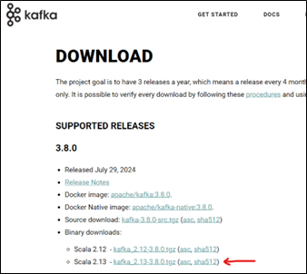
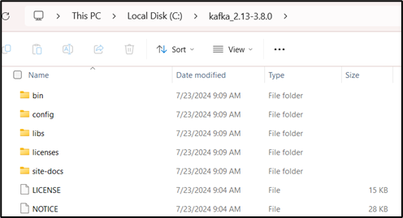
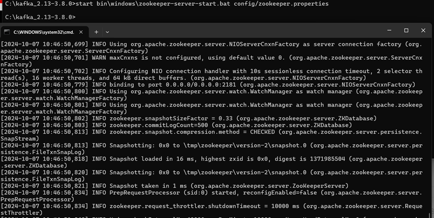
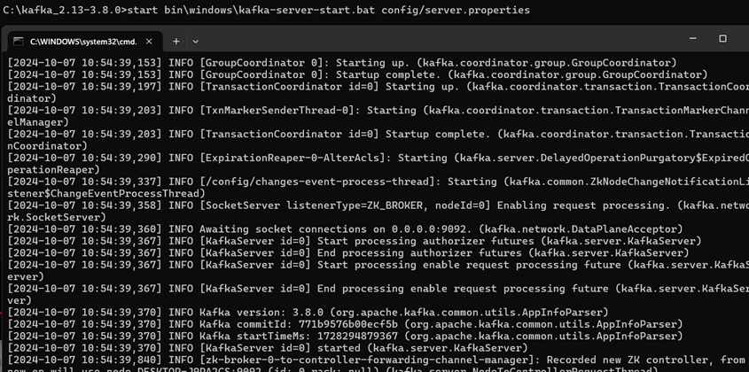
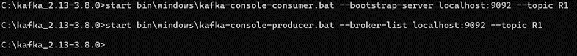
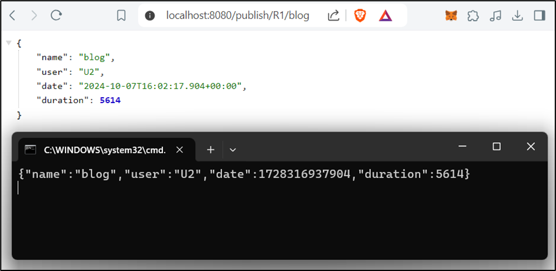
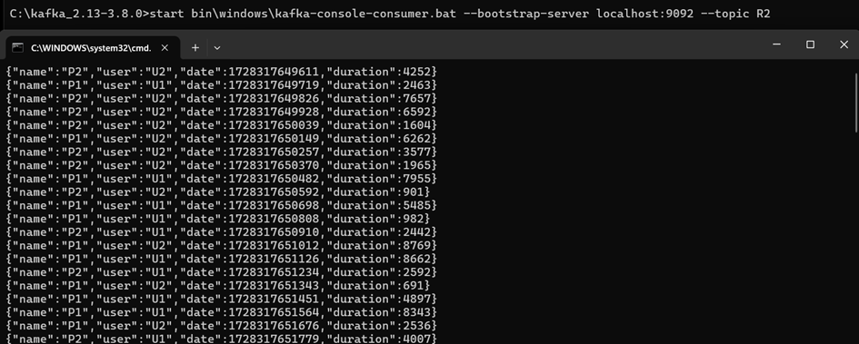

# Kafka Event-Driven Architecture with Spring Cloud Stream

## Description
This project demonstrates the implementation of an Event-Driven Architecture using Kafka and Spring Cloud Stream. It includes a Kafka producer, consumer, supplier, and a real-time stream processing service. The data is displayed on a web application in real-time using Kafka Streams.

## Features
- Kafka Producer: Sends messages to a Kafka topic via a REST controller.
- Kafka Consumer: Listens and consumes messages from a Kafka topic.
- Kafka Supplier: Provides messages to Kafka at regular intervals.
- Real-time Stream Processing: Uses Kafka Streams to process and analyze data in real time.
- Web Application: Displays the results of real-time data processing.

## Technologies
- Java 8+
- Spring Boot
- Spring Cloud Stream
- Apache Kafka
- Docker (for running Kafka and Zookeeper containers)
- Maven

## Setup
1. Clone the repository:

```bash
git clone https://github.com/relmarrakchy/Event-Drive-Architecture-using-Kafka.git
```

2. Access the project directory:

```bash
cd Event-Drive-Architecture-using-Kafka
```

3. You can run kafka and zookeeper even in your local machine or using docker-compose :

- To run kafka and zookeeper in your local machine, you can go to this link: https://kafka.apache.org/downloads and download the kafka and zookeeper binaries, extract it and run them in your local machine (To run them you can follow the commands in commands.txt file).


- Extract the downloaded files and navigate to the kafka directory :
  
- Start the zookeeper server :
  
- Start the kafka server :
  
- Test with Kafka-console-producer and kafka-console-consumer :
  

- To run kafka and zookeeper using docker-compose, you can run the following command:
```bash
docker-compose up
```

4. Run the Spring Boot applications.



